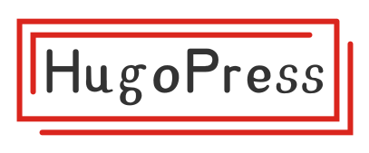

<p align="center">
    
</p>

Pluggable and UI less [Hugo](https://gohugo.io/) modules framework, which defines several functions and partials to load and render Hugo modules automatically.
The main advantage is that once the theme support HugoPress, their users have the ability to install the modules without requesting new features to the theme.

## Principle

There are two key concepts: `attributes` and `hooks`.

### Attributes

The `attributes` are used to append attributes to HTML tags.

| Name | Description
|---|---
| `document` | The attributes will be appended into the `<html>` tag.
| `body` | The attributes will be appended into the `<body>` tag.

The attributes partial should return key-value pairs.

```html
{{- return dict
  "lang" .Lang
  "data-foo" "bar"
  "data-hello" "world"
}}
```

### Hooks

The `hooks` are used to render HTML of the module in a specific place, such as `<head>`, `<body>`.

| Name | Description
|---|---
| `head-begin` | At the beginning of the `<head>` tag.
| `head-end` | Before the `<head>` end.
| `body-begin` | At the beginning of the `<body>` tag.
| `body-end` | Before the `<body>` end.

## Modules

Modules that support HugoPress.

- [Google Adsense](https://github.com/razonyang/hugo-mod-google-adsense)
- [Font Awesome SVG JS Module](https://github.com/razonyang/hugo-mod-font-awesome-svg-js)
- Add modules here via PR.

## Themes

Themes that support HugoPress.

- List your theme here by creating a PR.

## Guide

### Create a HugoPress Theme

Modify the `layouts/_default/baseof.html` as following, and then override the `theme` blocks and the `layouts/partials/head.html` with your own.

```html
<!DOCTYPE html>
<html {{ partial "hugopress/document-attributes" . | safeHTMLAttr -}}>
  <head>
    {{- partial "hugopress/head-begin.html" . }}
    {{/* Theme head block begin. */}}
    <title>{{- block "title" . -}}{{ printf "%s | %s" .Title .Site.Title }}{{- end -}}</title>
    {{/* Theme head block end. */}}
    {{- partial "hugopress/head-end.html" . }}
  </head>
  <body {{ partial "hugopress/body-attributes" . | safeHTMLAttr -}}>
    {{- partial "hugopress/body-begin.html" . }}
    {{/* Theme body block begin. */}}
    {{- block "main" . }}{{- end }}
    {{/* Theme body block end. */}}
    {{- partial "hugopress/body-end.html" . }}
  </body>
</html>
```

### Create a HugoPress Modules

Let's take the `hello` module as an example, which

1. Append `data-hello="world"` into the `<html>` tag.
1. Generate `<meta name="hello" content="world">` inside the `<head>` tag.
1. Print `Hello world.` at the beginning of `<body>` tag.

#### Initialize Module

```
$ mkdir hugo-mod-hello
$ cd hugo-mod-hello
$ hugo mod init github.com/user/hugo-mod-hello
```

#### Modules Configuration

```toml
[params.hugopress.modules.hello.attributes.document]
[params.hugopress.modules.hello.hooks.head-end]
[params.hugopress.modules.hello.hooks.body-begin]
```

We need to specify the attributes and hooks used by the module in `config.toml`.

#### Modules Architecture

```
$ tree layouts/partials/hugopress/modules/hello
├── attributes
│   └── document.html
└── hooks
    ├── body-begin.html
    └── head-end.html
```

The module files should be placed under the `layouts/partials/hugopress/modules` folder.

> The source code can be found at [hello module files](exampleSite/layouts/partials/hugopress/modules/hello).

#### Disable Module

```toml
[params.hugopress.modules.hello]
disable = true
```

#### Hooks Weight

High weight gets higher precedence.

```toml
[params.hugopress.modules.hello.hooks.body-begin]
weight = 100
```
